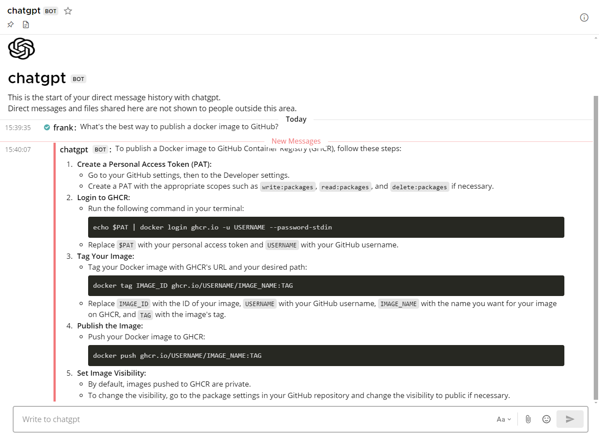
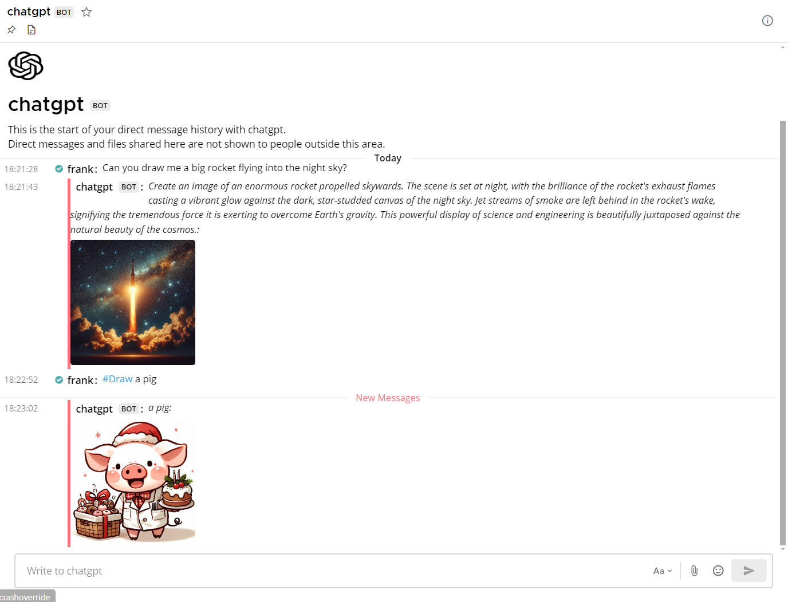

[](https://github.com/Elehiggle/ChatGPTMattermostChatbot/stargazers)
[](https://github.com/Elehiggle/ChatGPTMattermostChatbot/actions/workflows/docker-publish.yml)
[](https://hub.docker.com/r/elehiggle/chatgptmattermostchatbot)
[](https://hub.docker.com/r/elehiggle/chatgptmattermostchatbot)
[](https://github.com/Elehiggle/ChatGPTMattermostChatbot/commits/master)
[](https://app.codacy.com/gh/Elehiggle/ChatGPTMattermostChatbot/dashboard?utm_source=gh&utm_medium=referral&utm_content=&utm_campaign=Badge_grade)
[](https://github.com/Elehiggle/ChatGPTMattermostChatbot/blob/master/LICENSE)

# ChatGPTMattermostChatbot



This project is a chatbot for Mattermost that integrates with the OpenAI API to provide helpful responses to user messages. The chatbot - like this readme - is mostly written by **Claude 3 AI**, listens for messages mentioning the chatbot or direct messages, processes the messages, and sends the responses back to the Mattermost channel.

## Features

- **Responds to messages** mentioning "@chatbot" (or rather the chatbot's username) or direct messages
- Extracts **images, PDFs and other files** from message attachments and from **URL links** in messages
- Supports **FlareSolverr** to bypass Javascript/CAPTCHA restrictions
- Supports **DALL-E-3 image generation** via function calling
- Supports the **Vision API** for describing images. Images from PDFs will also be sent here
- **Gets transcripts of YouTube videos** for easy tl;dw summarizations. Title, description and uploader are also
  provided
- Accesses additional live information via function calling (requires TOOL_USE_ENABLED="TRUE").
  Currently supported: **stock data** (via Yahoo Finance, eg. ask about AAPL)
  **cryptocurrency data** (
  via [Coingecko](https://api.coingecko.com/api/v3/coins/markets?vs_currency=usd&order=market_cap_desc&per_page=500&page=1&sparkline=false&price_change_percentage=24h%2C7d)),
  **fiat currency exchange rates** (via [ECB](https://www.ecb.europa.eu/stats/eurofxref/eurofxref-daily.xml))
- Sends screenshots of rendered raw HTML code or from URLs (via function calling).
- Maintains context of the conversation within a thread
- Sends typing indicators to show that the chatbot is processing the message
- Utilizes a thread pool to handle multiple requests concurrently (due to `mattermostdriver-asyncio` being outdated)
- Offers **Docker support** for easy deployment

## Prerequisites

- Python 3.11 or just a server with [Docker](https://docs.docker.com/get-started/) _(you can get away with using 3.8 if
  you use datetime.datetime.utcnow() instead of datetime.datetime.now(datetime.UTC))_
- OpenAI API key
- Mattermost Bot token (alternatively personal access token or login/password for a dedicated Mattermost user account for the chatbot)
- The bot account needs to be added to the team and to the channels you want it to watch

## Installation

1. Prepare a Mattermost bot account token and OpenAI API key

    - Create an OpenAI API key [here](https://platform.openai.com/api-keys)
    - Create a Mattermost bot account token directly in the chat: _Left menu -> Integrations -> Bot accounts_. Give it
      the post:channels permission (this also suffices for DMs)

2. Clone the repository:

    ```bash
    git clone https://github.com/Elehiggle/ChatGPTMattermostChatbot.git
    cd ChatGPTMattermostChatbot
    ```

3. Install the required dependencies:

    ```bash
    pip3 install -r requirements.txt
    ```
   _or alternatively:_
    ```bash
    python3 -m pip install openai mattermostdriver certifi beautifulsoup4 pillow httpx youtube-transcript-api yt-dlp PyMuPDF defusedxml yfinance pymupdf4llm tiktoken nodriver
    ```

4. Set the following environment variables with your own values:

| Parameter              | Description                                                                                                                                                                                                |
|------------------------|------------------------------------------------------------------------------------------------------------------------------------------------------------------------------------------------------------|
| `AI_API_KEY`           | Required. Your OpenAI API key                                                                                                                                                                              |
| `AI_MODEL`             | The OpenAI model to use. Default: "gpt-4o"                                                                                                                                                                 |
| `MATTERMOST_URL`       | Required. The URL of your Mattermost server                                                                                                                                                                |
| `MATTERMOST_TOKEN`     | Required if not using user/password. The bot token (alternatively personal access token) with relevant permissions created specifically for the chatbot. Don't forget to add the bot account to the team   |
| `MATTERMOST_USERNAME`  | Required if not using token. The username of the dedicated Mattermost user account for the chatbot (if using username/password login)                                                                      |
| `MATTERMOST_PASSWORD`  | Required if not using token. The password of the dedicated Mattermost user account for the chatbot (if using username/password login)                                                                      |
| `MATTERMOST_MFA_TOKEN` | The MFA token of the dedicated Mattermost user account for the chatbot (if using MFA)                                                                                                                      |
| `TOOL_USE_ENABLED`     | Allows tool function calling for live data and image generation. Slightly increased cost because input is filled with function definitions (roughly 0.15 **cents** per query, 0.0015 USD). Default: "TRUE" |

### Extended optional configuration variables

| Parameter                     | Description                                                                                                                                                                                                                                                                                     |
|-------------------------------|-------------------------------------------------------------------------------------------------------------------------------------------------------------------------------------------------------------------------------------------------------------------------------------------------|
| `AI_SYSTEM_PROMPT`            | The system prompt/instructions. Default: [click](https://github.com/Elehiggle/ChatGPTMattermostChatbot/blob/76a596cda2d26bb2f00f42c96451ec46be941f49/chatbot.py#L102) (Subject to change. current_time and CHATBOT_USERNAME variables inside the prompt will be auto-formatted and substituted. |
| `AI_TIMEOUT`                  | The timeout for the AI API call in seconds. Default: "120"                                                                                                                                                                                                                                      |
| `MAX_TOKENS`                  | The maximum number of tokens to generate in the response. Default: "4096" (max)                                                                                                                                                                                                                 |
| `TEMPERATURE`                 | The temperature value for controlling the randomness of the generated responses (0.0 = analytical, 1.0 = fully random). Default: "1"                                                                                                                                                            |
| `IMAGE_SIZE`                  | The image size for image generation. Default: "1024x1024" (see [docs](https://platform.openai.com/docs/guides/images/usage?context=node) for allowed types)                                                                                                                                     |
| `IMAGE_QUALITY`               | The image quality for image generation. Default: "standard" (also: "hd")                                                                                                                                                                                                                        |
| `IMAGE_STYLE`                 | The image style for image generation. Default: "vivid" (also: "natural")                                                                                                                                                                                                                        |
| `TYPE_INDICATOR_MODE`         | "FULL" = typing indicator will be sent to main thread/channel and the subthread; "THREAD" = only to the subthread, unless there is none (this is kinda expected behaviour, but I prefer full. Default: "FULL"                                                                                   |
| `MAX_RESPONSE_SIZE_MB`        | The maximum size of the website or file content to extract (in megabytes, per URL/file). Default: "100"                                                                                                                                                                                         |
| `FLARESOLVERR_ENDPOINT`       | Endpoint URL to your [FlareSolverr](https://github.com/FlareSolverr/FlareSolverr) instance (eg. "<http://192.168.1.55:8191/v1>"). If you use this, MAX_RESPONSE_SIZE_MB won't be honored since it can't stream content. For most effectiveness, use a residential IP endpoint                   |
| `BROWSER_EXECUTABLE_PATH`     | Path to a Chromium binary which is used for the raw_html_to_image function call capability. Fully optional. Chromium is auto installed on the docker image. Default: "/usr/bin/chromium"                                                                                                        |
| `KEEP_ALL_URL_CONTENT`        | Whether to feed the AI all URL content from the whole conversation thread. The website result is cached in memory. If you only want it to know about the current message's URL content (due to context size or cost), set to "FALSE". Default: "TRUE"                                           |
| `MATTERMOST_IGNORE_SENDER_ID` | The user ID of a user to ignore (optional, useful if you have multiple chatbots that are not real bot accounts to prevent endless loops). Supports multiple, separated by comma                                                                                                                 |
| `MATTERMOST_PORT`             | The port of your Mattermost server. Default: "443"                                                                                                                                                                                                                                              |
| `MATTERMOST_SCHEME`           | The scheme of the connection. Default: "https"                                                                                                                                                                                                                                                  |
| `MATTERMOST_BASEPATH`         | The basepath of your Mattermost server. Default: "/api/v4"                                                                                                                                                                                                                                      |
| `MATTERMOST_CERT_VERIFY`      | Cert verification. Default: True (also: string path to your certificate file)                                                                                                                                                                                                                   |
| `AI_API_BASEURL`              | AI API Base URL. Default: None (which will use "<https://api.openai.com/v1/>"). Useful if you want to use a different AI with OpenAI compatible endpoint                                                                                                                                        |
| `LOG_LEVEL`                   | The log level. Default: "INFO"                                                                                                                                                                                                                                                                  |
| `LOG_LEVEL_ROOT`              | The root log level (for other modules than this chatbot). Default: "INFO"                                                                                                                                                                                                                       |

## Usage

Run the script:

```bash
python3 chatbot.py
```

The chatbot will connect to the Mattermost server and start listening for messages.
When a user mentions the chatbot in a message or sends a direct message to the chatbot, the chatbot will process the
message, extract content from links (if any), process images, PDFs and other files, handle image content using the
Vision API, if necessary queries the DALL-E-3 API, and send the response back to the Mattermost channel.

> **Note:** If you don't trust your users at all, it's recommended to disable the URL/image grabbing feature, even though the chatbot filters out local addresses and IPs.

### Running with Docker

You can also run the chatbot using Docker. Use the following command to run the chatbot container:

```bash
docker run -d --name chatbotgpt \
  -e AI_API_KEY="your_ai_api_key" \
  -e AI_MODEL="gpt-4-turbo" \
  -e MATTERMOST_URL="mattermostinstance.example.com" \
  -e MATTERMOST_TOKEN="your_mattermost_token" \
  -e MAX_TOKENS="4096" \
  -e TEMPERATURE="1" \
  ghcr.io/elehiggle/chatgptmattermostchatbot:latest
```

### Using DALL-E-3 image generation



The AI will generate pictures for you. If you start your message with a "#" it will try to use your prompt as is without
any modification by the API.

## How does this bot differ from the official Mattermost AI plugin?

The official [Mattermost AI plugin](https://github.com/mattermost/mattermost-plugin-ai) is a great way to integrate AI
into your Mattermost server with its own advantages, like a nice UI.
However, the features differ greatly. It requires direct access to the server, whereas this bot merely needs a bot token
and can be conveniently used in a Docker environment.

Also there is:

- no fine granular control over certain settings (especially AI settings)
- no CAPTCHA bypass
- no image generation
- no Vision API
- no PDF parsing
- no YouTube transcript fetching
- and more

While the official plugin certainly will improve over time, this bot here will too and there will be certain features
that will absolutely never make it into the official plugin, due to it primarily focusing on features for developers
like function calling to retrieve GitHub issues, for example.

## Known Issues

While the chatbot works great for me, there might still be some bugs lurking inside. I have done my best to address
them, but if you encounter any issues, please let me know!

## Monkey Patch

Please note that the monkey patch in the code is necessary due to some SSL errors that occur because of a mistake within the `mattermostdriver` library. The patch ensures that the chatbot can establish a secure connection with the Mattermost server.

## Related Projects

[Anthropic Claude 3 Mattermost Chatbot](https://github.com/Elehiggle/Claude3MattermostChatbot)

## Contributing

Contributions are welcome! If you find any issues or have suggestions for improvements, please open an issue or submit a pull request.

## License

This project is licensed under the MIT License.

## Acknowledgements

- [OpenAI](https://openai.com/) for providing the API for generating responses
- [Mattermost](https://mattermost.com/) for the messaging platform
- [mattermostdriver](https://github.com/Vaelor/python-mattermost-driver) for the Mattermost API client library
- [chatgpt-mattermost-bot](https://github.com/yGuy/chatgpt-mattermost-bot) for inspiring me to write this python code
- [youtube-transcript-api](https://pypi.org/project/youtube-transcript-api/) for the YouTube Transcript Fetch library
- [yt-dlp](https://pypi.org/project/yt-dlp/) for the YouTube API that allows us to fetch details
- [PyMuPDF](https://pypi.org/project/PyMuPDF/) for the comprehensive PDF parsing library
- [beautifulsoup4](https://pypi.org/project/beautifulsoup4/) for the HTML parsing library
- [pillow](https://pypi.org/project/pillow/) for the image processing library
- [httpx](https://pypi.org/project/httpx/) for the HTTP client library
- [certifi](https://pypi.org/project/certifi/) for the certificate verification library
